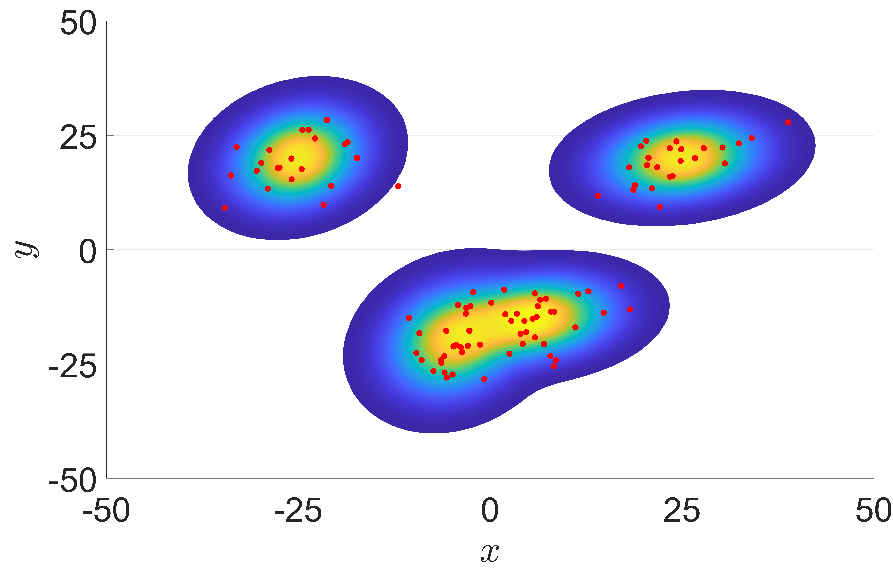
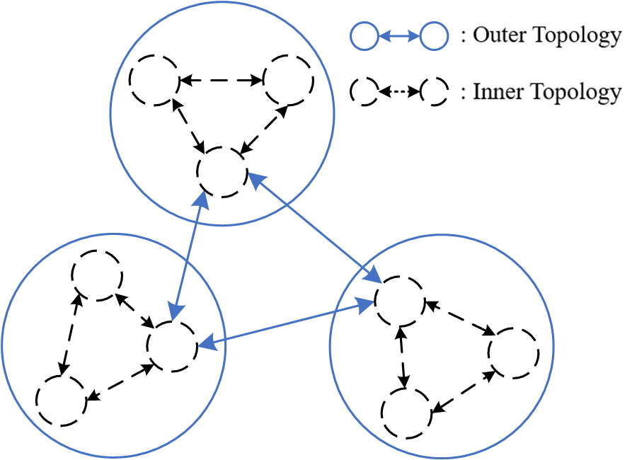
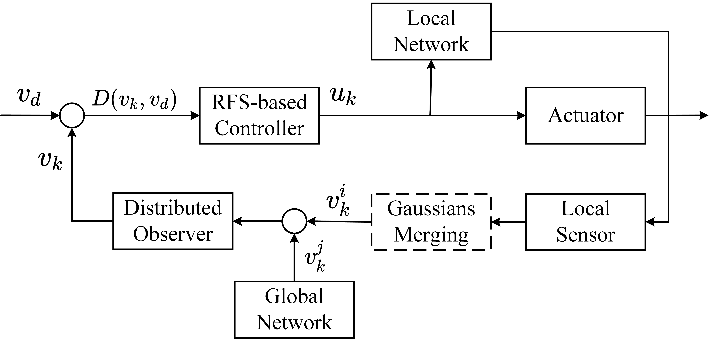
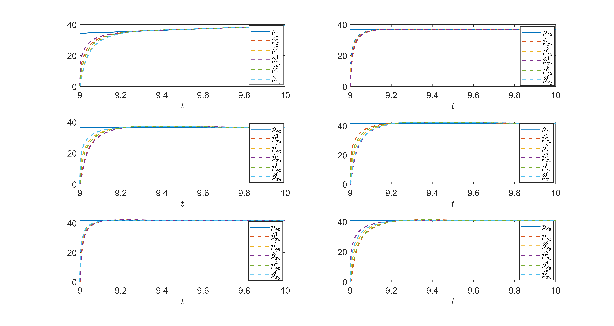
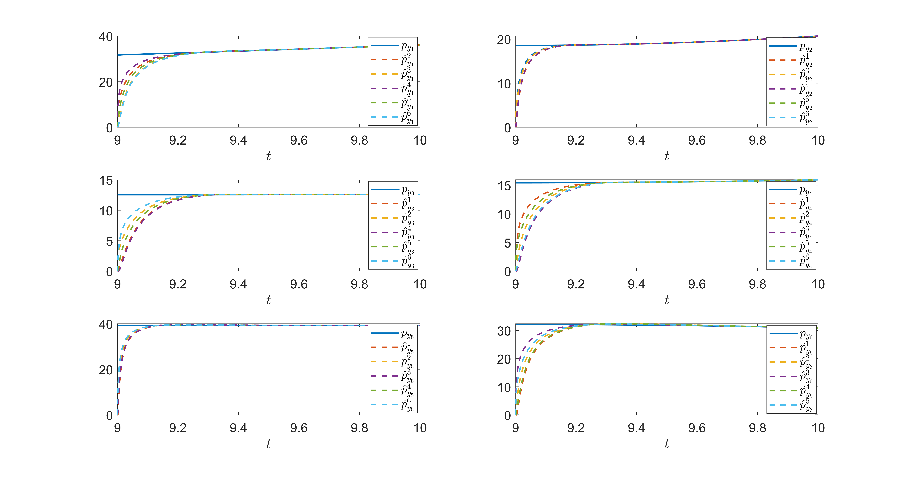

# Distributed Swarm Control Based on Random Finite Set Theory
##(The saved data is not match with the current version!!!)

[](https://github.com/RichardLitt/standard-readme)

**Topic:** Simulation of Distributed Large-Scale Swarms Control in Obstacle Environment Based on Random Finite Set Theory

Utilizing MATLAB R2022b, this numerical simulation is carried out
to demonstrate the RFS-based control method, which shows the
obstacle avoidance trajectories and flexible assignment of multiple sub-swarms. The convergence of global intensity for RFS-based control based on distributed fixed-time observer is also presented.

This repository contains:

1. The description (README.md) of code composition and dynamic result.
2. The source code (*.m) of RFS-based control and plot.
3. The picture (*.png and *.gif) of result.

## Table of Contents

- [Background](#background)
- [Code Description](#code-description)
- [Simulation Results](#simulation-results)
- [Twin System Test](#twin-system-test)
- [Reference](#reference)

## Background
> In the RFS-based control, the swarms modeled by GM are shown in [figure](#gm), which is a visualization of GM model distribution. The swarms are composed of 4 sub-swarms, which including 100 agents showed by red points. When multiple sub-swarms have similar distribution, they will be merged into a sub-swarm to reduce computation.

### 
> Each sub-swarm can choose a main node to calculate the control law of this sub-swarm, avoiding redundant resource consumption. The network structure of swarms is demonstrated in [figure](#topology).

### 
> The main node conducts distributed MPC to find the feasible
solution of the control law for their sub-swarms, and
communicate with other nodes by the local network.  The closed-form of distributed
swarms control framework based on RFS formulation is demonstrated as [figure](#control).

### 

## Code Description
```sh
$ main.m
# The initial conditions are setted, such as swarms states, obstacle and toppology.
# The main loop of swarm control are conducted.
```
```sh
$ controller.m
# The distributed MPC via MATLAB optimization toolbox is conducted for once iteration.
```
```sh
$ observer.m
# The distributed fix-time observer is conducted for once iteration.
```
```sh
$ cut.m
# The Gaussians merging is conducted for once iteration.
```
```sh
$ JD1.m / JD2.m
# The adaptive cost function is constructed.
```
```sh
$ plot_*.m
# Some plot codes of result.
```

## Simulation Results
> Swarm trajectories with cost function $D_{\alpha}$
 
 
 
 Cost value of $D_{\alpha}$
 

> Swarm trajectories with cost function $D_{\sigma}$
 
 
 
 Cost value of $D_{\sigma}$
 

> Consensus of global information
 
 

> Distance comparison with [1] and [2]
	
	
	
	

## Reference
[1] Doerr, B., Linares, R., Zhu, P. & Ferrari, S. Random Finite Set Theory and Centralized Control of Large Collaborative Swarms. J Guid Control Dyn 44, 505–521 (2021).

[2] Thomas, R. W. & Larson, J. D. Receding Horizon Extended Linear Quadratic Regulator for RFS-Based Swarms With Target Planning and Automatic Cost Function Scaling. IEEE Transactions Control Netw Syst 8, 566–575 (2020).

This work is inspired by [Dr.He](https://scholar.google.com/citations?user=ngDBADkAAAAJ&hl=zh-CN&oi=ao) and [brycedoerr/SwarmRFSControl](https://github.com/brycedoerr/SwarmRFSControl)


